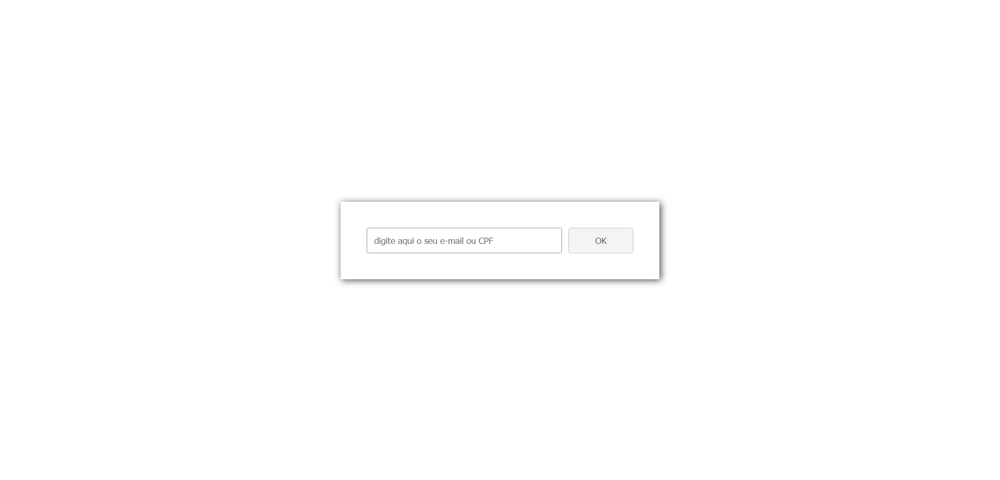

# Página com validador de CPF ou email inserido no input usando Regular Expressions

## Visão Geral

### Screenshot

### Links

- URL: https://viniciusdsv93.github.io/RegEx-email-CPF/

## Meu processo

### Construído com

- Marcação semântica de HTML
- Propriedades customizadas de CSS
- Flexbox
- JavaScript

### O que aprendi

Neste projeto eu pude utilizar Regular Expressions (expressões regulares) para validar as informações inseridas no input pelo usuário segundo a formatação exigida para email ou CPF.
Caso a informação preenchida no input seja válida, tanto como email quanto CPF, o botão se torna habilitado para clique.

## Autor

- GitHub - Vinícius dos Santos Verissimo (https://github.com/viniciusdsv93)
